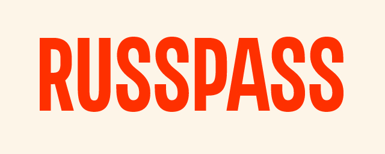
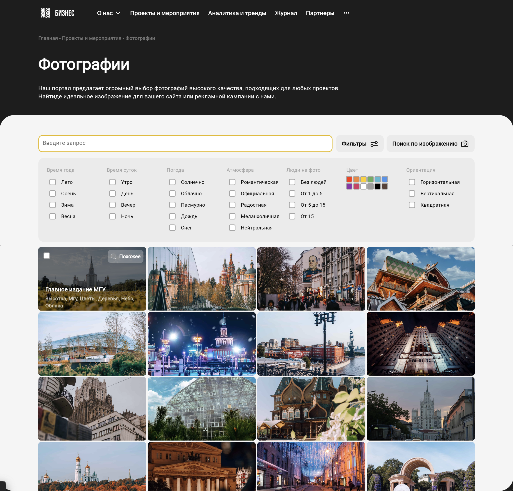
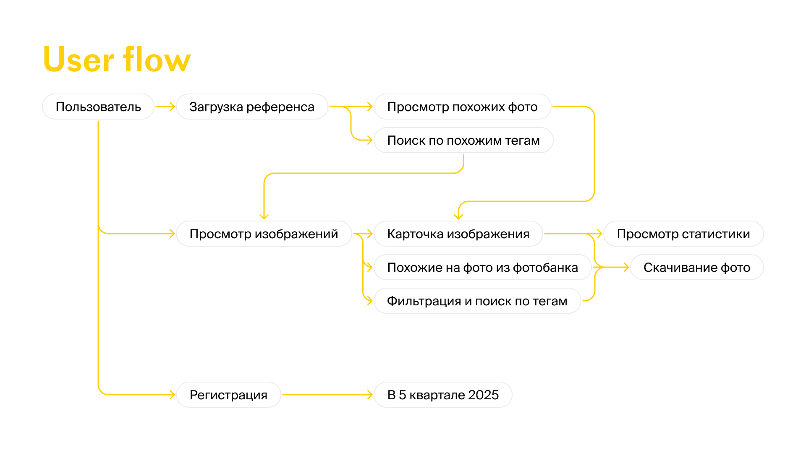
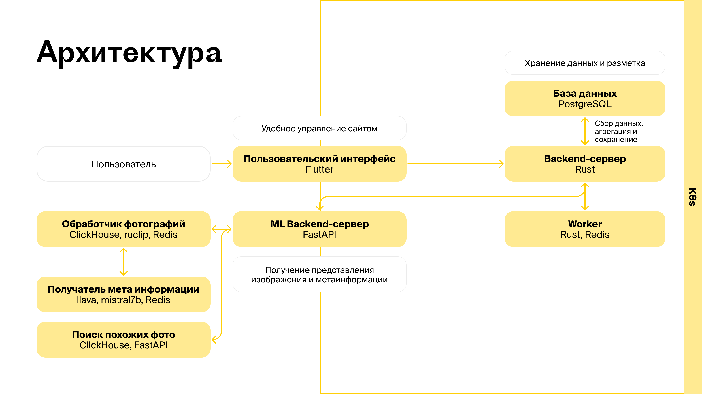

 

<a href="http://frontend.0xb1b1.com:81/"> Ссылка на демо</a>

<!-- Что сделали? -->
## Что сделали?

В рамках хакатона Moscow Travel Hack 2024 был разработан полноценный сервис для поиска фотографий. Платформа позволяет искать изображения по текстовым запросам, тегам, по загруженным референсам, а также по фотографиям, которые уже есть на сайте. Для поддержания стабильной работы и возможности пополнения фотобанка, была также разработана панель администратора. В разделе «Загрузка фотографий» администратор может загрузить изображения, отредактировать предложенные теги и опубликовать картинку. В соседнем разделе доступен дашборд, позволяющий оценивать тенденции и запросы пользователей.

<!-- USERFLOW -->
## Userflow

 

Для начала пользователь заходит на сайт и может или загрузить референс, или воспользоваться поисковой строкой и фильтрами. После этого, он может как продолжить поиск изображений, зацикливая предыдущие шаги, так и выгрузить картинку, изучив ее статистику. Также, мы предусмотрели функционал, доступный только зарегистрированным пользователям, чтобы привлекать их не только к открытому фотобанку, но и другим продуктам РуссПасс бизнес

## Как сделали?

### <b>Архитектура</b>
 

### <b>ML</b> 
Рекомендация изображений с помощью модели CLIP+Roberta для сочетания описаний, тегов и фото в единой области.

Поиск топ k изображений
по косинусной близости и тегам.

Дополнительные ml-фичи: 

<li>
генерация метаинформации фото и оценка количества людей с помощью llama-mistral
</li>

<li>
дублирование тегов и оповещения о сильно похожих фотографиях на основе косинусной смежности
</li>

### <b>Backend</b>

Разработано три микросервиса, отвечающих за общение с клиентами (frontend), обработку изображений (создание уменьшенных версий для ML
и миниатюр для frontend), и генерацию рекомендаций

### <b>Frontend</b>

Проведена качественная работа
над интерфейсом. A/B тесты, многократные пересмотры всех отступов, CJM, проверка корректной работы всех экранов для создания уникального опыта.
Всё спроектировано на основе паттернов разработки Flutter-приложений

## Что использовали?

<li>
Python
</li>

<li>
Pytorch
</li>

<li>
Hugging Face
</li>

<li>
Flatter
</li>

<li>
Rust
</li>

<li>
Clickhouse
</li>

<li>
PostgreSQL
</li>

<li>
K8s
</li>